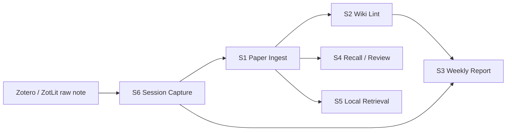

# OMyPaper Skills Handbook

## Purpose

This repository is a local paper knowledge vault for the workflow:

`Zotero -> ZotLit -> LiteratureNotes -> SessionNotes -> Notes wiki -> Weekly / Review outputs`

The goal of this handbook is to make future agent work stable, conservative, and traceable. The seven skills in `Management/Skills/` are the operating protocol for this vault. They are designed to help the agent maintain durable knowledge assets instead of only giving one-off answers.

## Vault Structure

```text
OMyPaper/
+- Attachments/                  # PDFs, figures, snapshots, supplementary files
+- LiteratureNotes/              # Raw imported notes from ZotLit; read-only for S0-S6
+- Notes/                        # Long-lived wiki layer maintained by agent
|  +- Papers/                    # One page per paper, named by citekey
|  +- Concepts/                  # Concept pages
|  +- Methods/                   # Method pages
|  +- Comparisons/               # Comparison pages
|  +- Topics/                    # Topic pages and thematic synthesis
+- Management/                   # Rules, indices, logs, reports, templates, skills
   +- Skills/                    # S0-S6 skill specs
   +- Templates/                 # Reusable markdown templates
   +- SessionNotes/              # Standardized high-value session captures
   |  +- _unmatched/             # Sessions not confidently matched to a paper
   +- WeeklyReports/             # Weekly outputs
   +- ReviewNotes/               # Recall / review outputs
   +- LintReports/               # Whole-vault health reports
   +- BootstrapReports/          # S0 environment / consistency reports
```

## The Seven Skills

| Skill | Name | Primary Job | Main Output |
| --- | --- | --- | --- |
| S0 | Vault Bootstrap & Consistency Check | Bootstrap the vault, verify directories, initialize missing control files, report conflicts | `Management/BootstrapReports/*.md` |
| S1 | Paper Ingest & Wiki Builder | Compile one paper into the wiki layer | `Notes/Papers/{citekey}.md` and related wiki updates |
| S2 | Wiki Lint & Refactor | Check the whole wiki structure and apply only low-risk fixes | `Management/LintReports/YYYY-MM-DD.md` |
| S3 | Weekly Report Builder | Generate a weekly synthesis from local activity | `Management/WeeklyReports/YYYY/YYYY-Www.md` |
| S4 | Paper Recall & Review Assistant | Help the user recall how they understood a paper | `Management/ReviewNotes/{citekey}-review-YYYYMMDD.md` |
| S5 | Local Retrieval & Re-read Navigator | Answer a question by navigating local evidence first | Read-only answer with file paths and re-read order |
| S6 | Session Capture & Paper Matching | Distill high-value conversation into standardized intermediate notes | `Management/SessionNotes/{citekey}/...` or `_unmatched/` |

## Quick Contracts

This section gives a compact "what goes in / what comes out / what it must not do" snapshot for each skill. The detailed steps live in each `SKILL.md`.

| Skill | Typical Input | Main Reads | Main Writes | Must Not Do |
| --- | --- | --- | --- | --- |
| S0 | whole-vault check, bootstrap request | root dirs, `Management/`, `Notes/`, `LiteratureNotes/` | control files, bootstrap report, log | organize paper content or edit raw notes |
| S1 | one paper identity, ideally citekey | target literature note, pending session notes, PDF, related wiki | paper page, related wiki pages, registry, log | skip session notes, rewrite raw notes, force uncertain claims |
| S2 | whole-vault or scoped lint request | `Notes/`, index, registry | lint report, low-risk structure fixes | deep semantic rewriting or risky merges |
| S3 | current week or explicit week ID | log, weekly-updated notes, session notes, current questions | weekly report, log, optional index refresh | fabricate conclusions or write a raw changelog |
| S4 | one paper plus review mode | literature note, paper wiki, session notes, related pages | review note, log | pretend recall equals understanding when evidence is thin |
| S5 | natural-language question | `Notes/`, index, registry, raw notes if needed | normally read-only | answer without paths, hide missing evidence, substitute model memory |
| S6 | current discussion or session summary | conversation context, registry, session index, candidate notes | session note, session index, log | save raw transcript or directly edit formal wiki |

## Per-Skill Summary

### S0

- Role: environment bootstrap and consistency checking.
- Best input: "check whole vault and initialize missing management files."
- Key output: bootstrap report plus created/updated path list.
- Hard stop: report conflicts instead of aggressively repairing them.
- Detail: `Management/Skills/S0_vault_bootstrap_consistency_check/SKILL.md`

### S1

- Role: compile one paper into the durable wiki.
- Best input: explicit citekey plus instruction to read pending session notes first.
- Key output: `Notes/Papers/{citekey}.md` and minimal necessary related wiki updates.
- Hard stop: never rewrite `LiteratureNotes/`, and never turn session speculation into paper fact.
- Detail: `Management/Skills/S1_paper_ingest_wiki_builder/SKILL.md`

### S2

- Role: maintain structural health of the whole wiki layer.
- Best input: whole-vault lint request or narrowed scope such as Concepts/Methods.
- Key output: lint report and only low-risk structural fixes.
- Hard stop: do not perform large semantic rewrites or risky merges.
- Detail: `Management/Skills/S2_wiki_lint_refactor/SKILL.md`

### S3

- Role: produce a weekly decision-oriented synthesis from local activity.
- Best input: target week plus emphasis on stable conclusions, uncertainty, and re-read candidates.
- Key output: weekly report under `Management/WeeklyReports/`.
- Hard stop: do not write a pure流水账 or invent progress not present in local files.
- Detail: `Management/Skills/S3_weekly_report_builder/SKILL.md`

### S4

- Role: help the user recall their own understanding of a paper.
- Best input: citekey plus one of four review modes.
- Key output: review note that foregrounds user understanding and weak spots.
- Hard stop: do not rewrite the paper abstract and pretend that is recall.
- Detail: `Management/Skills/S4_paper_recall_review/SKILL.md`

### S5

- Role: local-first retrieval and re-read guidance.
- Best input: a question about a concept, method, comparison, or phenomenon.
- Key output: answer plus relevant paths, why they matter, and re-read order.
- Hard stop: do not use generic model knowledge to hide local evidence gaps.
- Detail: `Management/Skills/S5_local_retrieval_reread_navigator/SKILL.md`

### S6

- Role: capture durable insight from a valuable paper discussion.
- Best input: current discussion plus explicit citekey if known.
- Key output: standardized session note ready for later S1 ingestion.
- Hard stop: if the match is unstable, route to `_unmatched/` instead of forcing assignment.
- Detail: `Management/Skills/S6_session_capture_paper_matching/SKILL.md`

## Global Rules

All seven skills must obey the following rules.

1. `LiteratureNotes/` is the raw layer and is read-only for S0-S6.
2. `Notes/` and `Management/` are writable, but every write must remain traceable.
3. Every important statement should be distinguished whenever possible:
   - `Paper claim`
   - `My note`
   - `LLM synthesis`
4. Paper identity resolution priority is fixed:
   - `citekey`
   - `zotero-key`
   - `title`
   - source note / attachment path
   - current-session guess
5. When evidence is weak, the agent must be conservative:
   - mark `待核实`
   - save unmatched material to `Management/SessionNotes/_unmatched/`
   - report instead of force-merging
6. Every skill that writes files must report:
   - files created
   - files updated
   - exact paths
   - remaining uncertainties
7. Skills must not compete for the same job:
   - S0 handles environment and consistency only
   - S1 handles single-paper wiki ingest
   - S2 handles whole-vault structure health
   - S3 handles stage output and weekly synthesis
   - S4 handles recall and review
   - S5 handles local retrieval and navigation
   - S6 handles session capture and paper matching

## Recommended Workflows

### A. Daily Reading Workflow

1. Read and annotate in Zotero.
2. Sync raw paper notes into `LiteratureNotes/` via ZotLit.
3. During or right after discussion with the agent, run S6 to capture high-value session content.
4. After the paper is understood well enough, run S1 to compile it into `Notes/Papers/{citekey}.md` and related wiki pages.
5. When you need to recall the paper later, run S4.
6. When you need to answer a concept or method question, run S5 first.

### B. Weekly Maintenance Workflow

1. Run S2 to inspect structural issues across `Notes/`.
2. Review the generated lint report and decide whether medium/high-risk changes should be executed manually later.
3. Run S3 to generate the weekly report from local files.

### C. Initial Setup or Large Reorganization

1. Run S0 first.
2. Confirm the generated bootstrap report and unresolved conflicts.
3. Only after that, start S1/S2/S6 work on specific papers or topics.

## Recommended Invocation Order

Typical collaboration order across the skills:



## File-Level Control Documents

The following files are the main operating surfaces for this vault:

- [`Management/index.md`](./index.md): top-level management index
- [`Management/log.md`](./log.md): append-only operational log
- [`Management/PaperRegistry.md`](./PaperRegistry.md): paper registry keyed by citekey
- [`Management/SessionIndex.md`](./SessionIndex.md): session note registry
- [`Management/CurrentQuestions.md`](./CurrentQuestions.md): active unresolved questions
- [`Management/FrontmatterSpec.md`](./FrontmatterSpec.md): schema and frontmatter rules
- [`Management/SkillCalls.md`](./SkillCalls.md): direct call examples for future use

## Extension Guidance

This structure is designed to support future skills without breaking current responsibilities. New skills should follow these rules:

1. Reuse `Management/Templates/` and `Management/FrontmatterSpec.md`.
2. Declare a narrow write scope and do not overlap heavily with existing skills.
3. Prefer new directories under `Management/Skills/` for skill specs and new report folders under `Management/`.
4. Keep `LiteratureNotes/` read-only unless a future dedicated raw-note-repair skill is added.

## First Practical Use

Because the vault is currently a clean scaffold, a sensible initial sequence is:

1. Start using ZotLit to import raw notes into `LiteratureNotes/`.
2. Use S6 after each valuable reading/chat session.
3. Use S1 when a paper is ready to become part of the durable wiki.
4. Use S2 and S3 weekly.
