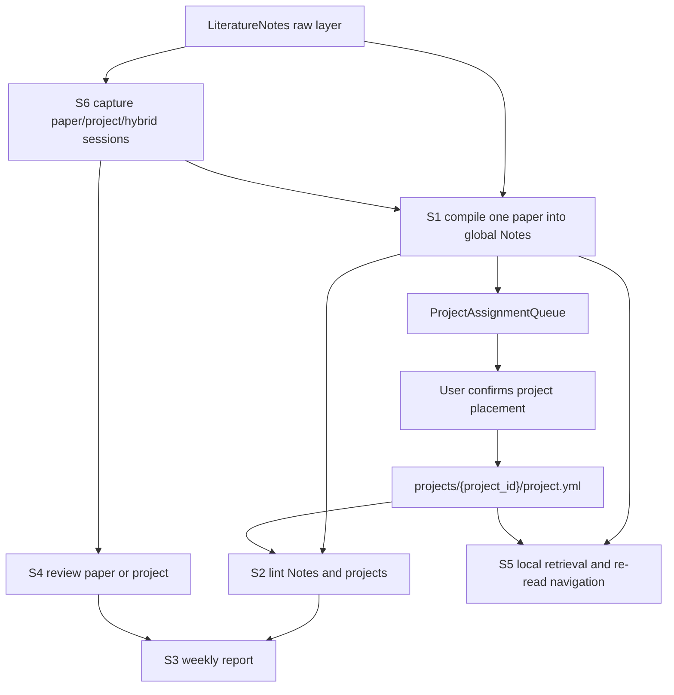

# OMyPaper Skills Handbook

This document explains how the local skill system is organized inside `OMyPaper/`.

The current system is no longer only paper-centric. It now supports:

- a unique global paper knowledge layer
- a hierarchical project tree with parent and child projects
- paper sessions, project sessions, and hybrid sessions
- project-aware weekly reporting, review, and retrieval

Detailed step-by-step behavior still lives in each `Management/Skills/.../SKILL.md`.

## 1. Repository Model

`OMyPaper/` is organized into four layers:

| Layer | Path | Role |
| --- | --- | --- |
| raw layer | `LiteratureNotes/` | Zotero / ZotLit reading trace; read-only for S0-S6 |
| global wiki layer | `Notes/` | durable paper, concept, method, comparison, and topic pages |
| project tree layer | `projects/` | parent / child / standalone projects with `project.yml`, `文献地图.md`, and `论文大纲.md` |
| control layer | `Management/` | rules, templates, indices, reports, sessions, and skill specs |

## 2. Canonical Control Files

The main control surface is:

- `Management/FrontmatterSpec.md`
- `Management/SkillCalls.md`
- `Management/index.md`
- `Management/PaperRegistry.md`
- `Management/SessionIndex.md`
- `Management/ProjectIndex.md`
- `Management/ProjectTree.md`
- `Management/ProjectAssignmentQueue.md`
- `Management/Templates/`

## 3. Skill Summary

| Skill | Name | Primary Scope | Default Output |
| --- | --- | --- | --- |
| `S0` | Vault Bootstrap & Consistency Check | whole vault, project tree, session layers | bootstrap / consistency report |
| `S1` | Paper Ingest & Wiki Builder | one paper -> global wiki -> project suggestion queue | paper wiki updates + project assignment suggestions |
| `S2` | Wiki Lint & Refactor | `Notes/` and `projects/` structural health | lint report with low-risk fixes |
| `S3` | Weekly Report Builder | weekly synthesis across papers and projects | weekly report |
| `S4` | Paper Recall & Review Assistant | paper / child project / parent project recall | review note |
| `S5` | Local Retrieval & Re-read Navigator | local-first retrieval across wiki and project tree | answer + paths + re-read path |
| `S6` | Session Capture & Paper Matching | paper session / project session / hybrid session capture | standardized session note |

## 4. Quick Contracts

### S0

- checks readiness of the global vault and hierarchical project tree
- initializes missing control files and support directories conservatively
- may initialize confidently matched `raw-only` rows in `Management/PaperRegistry.md`
- reports duplicate paper identity, invalid project manifests, tree cycles, and registry drift
- does not organize paper content

### S1

- first compiles one paper into the global wiki
- explicitly records source coverage when the raw note is thin and the ingest depends mainly on PDF or session evidence
- then scans the project tree for likely placement
- writes suggestions into `Management/ProjectAssignmentQueue.md`
- supports `parent + child`, `parent only`, and `none for now` suggestions explicitly
- does not directly edit `project.yml` by default

### S2

- lints `Notes/` and `projects/` together
- checks project manifests, literature maps, outlines, sibling overlap, and parent-child coherence
- may apply only low-risk structural fixes
- does not replace S1 or do deep semantic rewriting

### S3

- summarizes the week across paper reading, session capture, global wiki construction, and project-tree progress
- highlights stable conclusions, remaining uncertainty, and next focus areas
- does not invent content not supported by local files

### S4

- supports review for:
  - one paper
  - one child project
  - one parent project
- reconstructs the user's understanding and quick familiarization path
- does not replace formal wiki or project writing

### S5

- answers questions from the local vault first
- covers concepts, methods, experiments, papers, parent projects, child projects, and sibling comparisons
- returns both answer and navigation path
- stays read-only by default

### S6

- captures durable insight from:
  - paper discussions
  - child-project discussions
  - parent-project discussions
  - hybrid paper + project discussions
- writes standardized sessions for later reuse
- does not directly modify `Notes/` or `project.yml`

## 5. Global Rules

These rules apply across all skills:

1. `LiteratureNotes/` is read-only for S0-S6.
2. `Notes/` is the unique global paper knowledge layer.
3. `projects/` is the unique project-membership layer.
4. Project membership is written only through `project.yml`.
5. Do not write project-membership fields into `LiteratureNotes/` or `Notes/Papers/`.
6. Use `citekey` as the primary paper identifier.
7. Use `project_id` as the primary project identifier.
8. Distinguish:
   - `Paper claim`
   - `My note`
   - `LLM synthesis`
9. When uncertain, be conservative and prefer reporting over forced normalization.
10. Every write-capable skill must report created files, updated files, exact paths, and unresolved items.

## 6. Recommended Workflows

### A. Daily Reading Workflow

1. Read and annotate in Zotero.
2. Import raw notes into `LiteratureNotes/` through ZotLit.
3. Use `S6` whenever a valuable paper or project discussion should be preserved.
4. Use `S1` to compile the paper into the global wiki.
5. Let `S1` place project suggestions into `Management/ProjectAssignmentQueue.md`.
6. After user confirmation, reflect final placement in the relevant `project.yml`.
7. Use `S4` for recall and `S5` for retrieval.

### B. Project-Aware Workflow

1. Keep paper knowledge global and unique in `Notes/`.
2. Keep thematic grouping and project membership inside `projects/`.
3. Represent hierarchy through `parent_project` in `project.yml`.
4. Use `S6` to capture project-level reasoning before it is lost.
5. Use `S2` and `S3` to maintain and summarize project-tree health and progress.

### C. Weekly Maintenance Workflow

1. Run `S2` on `Notes/` and `projects/`.
2. Review the lint report.
3. Run `S3` for the weekly report.

### D. Bootstrap / Reorganization Workflow

1. Run `S0`.
2. Confirm missing files, tree conflicts, and registry mismatches.
3. Continue with `S1`, `S2`, or `S6` only after the structure is healthy enough.

## 7. Dependency Notes

- `S1` depends on raw notes, paper sessions, and current questions.
- `S1` may consult project sessions and the project tree when generating placement suggestions.
- `S2` benefits from `S1`-created paper pages and `project.yml` manifests.
- `S3` summarizes outputs from `S1`, `S2`, `S4`, and `S6`.
- `S4` relies on paper wiki, project files, and sessions.
- `S5` depends heavily on the accumulated quality of `S1`, `S2`, `S3`, `S4`, and `S6`.
- `S6` is the capture layer that feeds later synthesis work.

## 8. High-Level Flow

## 9. Where To Look Next

When you know which skill you need, open the corresponding file:

- `Management/Skills/S0_vault_bootstrap_consistency_check/SKILL.md`
- `Management/Skills/S1_paper_ingest_wiki_builder/SKILL.md`
- `Management/Skills/S2_wiki_lint_refactor/SKILL.md`
- `Management/Skills/S3_weekly_report_builder/SKILL.md`
- `Management/Skills/S4_paper_recall_review/SKILL.md`
- `Management/Skills/S5_local_retrieval_reread_navigator/SKILL.md`
- `Management/Skills/S6_session_capture_paper_matching/SKILL.md`
